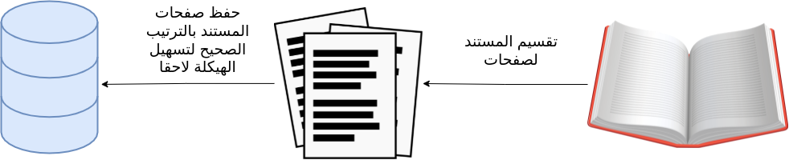
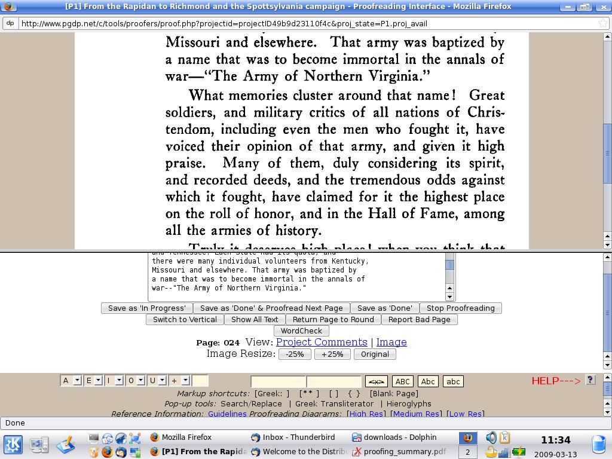
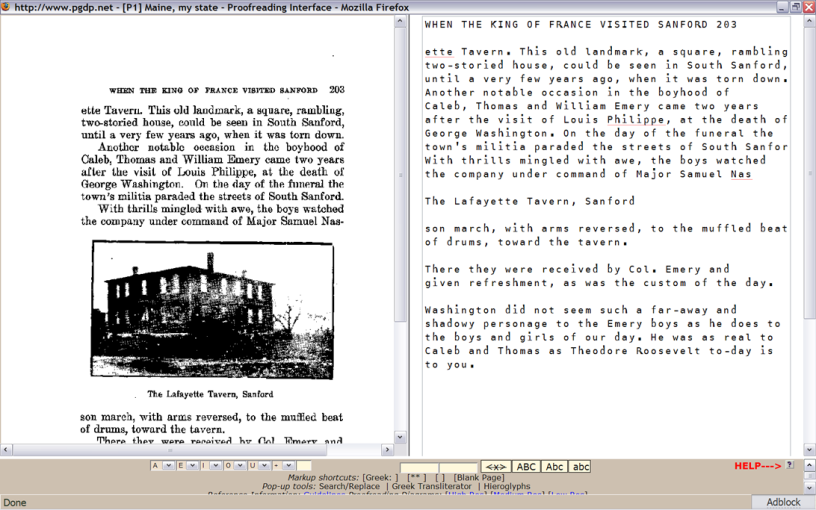

# مخطط لمشروع رقمنة الكتب عن طريق الجهد الموزع
##  الهدف
يهدف المشروع إلى إيجاد طريقة لرقمنة كتب التراث العربي عن طريق الجهد الموزع بين فئة كبيرة من الناس.


## للإستخدام
ﻹستخدام البرنامج بسهولة قمنا بإنشاء ملف دوكر يمكن تشغيله بواسطة أمر واحد وبعد ذلك يمكنك مباشرة
### متطلبات تشغيل البرنامج
* docker
### للتنصيب قم بتنزيل المشروع ومن داخل هذا المجلد قم بتشغيل
```bash
docker-compose up --build
```

بعد تشغيل اﻷمر السابق يمكنك تصفح البرنامج على الروابط التالية:

http://localhost:8080

http://localhost:1337/admin

http://localhost:4000

## مكونات النظام:

### وحدة تحليل المستند:
هذه الوحدة تستقبل مستند pdf ثم يقوم بتحليل كل صفحة على حدة ويستخرج كل صفحة في صورة يمكن الاستفادة من تقنيات مكتبة opencv وخصوصا [Contours](https://docs.opencv.org/master/d5/daa/tutorial_js_contours_begin.html)

تحفظ كل صورة و تعطى معرف خاص بها يسهل إرجاعها إلى مكانها الصحيح في المستند
مخرجات هذه الوحدة ملف xml أو قاعدة بيانات تحوي هيكلة الكتاب ومجلد فيه صور لكل صفحات الكتاب كل صفحة على حدة.



### وحدة توزيع الصور
تقوم هذه الوحدة باستخدام مخرجات وحدة تحليل المستند في صنع واجهة برمجية تستقبل طلب الصورة فتعيد صورة صفحة ثم تستقبل مدخلات الطلب وتتأكد من صحته ثم تخزن القيمة النصية في مكانها الصحيح في المستند.

### وحدة بناء المستند:
عمل هذه الوحدة هو إعادة بناء المستند إلى صورته الأصلية لكن باستخدم النصوص المرقونة والمنسقة مسبقا
مخرجات هذه الوحدة ملفات نصية أو html أو pdf أو كتاب اإلكتروني
يمكن الاستفادة من وحدة التحويل في برنامج [calibre](https://calibre-ebook.com) مفتوح المصدر لتحويل صيغة xhtml إلى كل [أنواع الصيغ الإلكترونية](https://manual.calibre-ebook.com/generated/en/ebook-convert.html)

### وحدة واجهة النظام للمستخدمين:
تعمل هذه الوحدة كواجهة استخدام للنظام حيث توفر:
- آلية تسجيل للأعضاء والمساهمين
- لوحة الإدارة: إدارة الأعضاء والمشاريع 
- مكان لإنشاء مشاريع كتب جديدة
- كل مشروع يوفر آلية رفع المستند غير المرقون ومتابعة مراحل تطوره إلى المرحلة النهائية
- صفحة المساهمة في الرقن وهي تتبع آلية الإدخال والتدقيق المذكورة لاحقا
- واجهة لعرض الاحصائيات من مثل الكلمات المرقونة والأسطر وعدد المستخدمين الكلي و الفعلي و الكتب المنجزة


### آلية الادخال والتدقيق تمر بالمراحل التالية:
1. (إدخال أولي) جولة رقن النص من صورة السطر المجلوبة من وحدة توزيع الصور.
2. (التدقيق الأولي) جولة التدقيق ١ تدقيق للنص ومقارنته بالصورة بعناية. 
3. (التدقيق الثاني) جولة التدقيق اللغوي الأولى بعد أكتمل تدقيق نصوص السطور ، يلزم الآن فحصها عن كثب بحثًا عن الأخطاء الصغيرة التي ربما تكون قد فاتتها.
4.  (التنسيق ١) جولة التنسيق 1 لقد تم بالفعل تدقيق نصوص الصفحات ، ولكن يلزم الآن تنسيقها باستخدام ترميزxhtml 
5. (التنسيق ٢) جولة التنسيق 2 يجب فحص نصوص الصفحات في هذه الجولة بعناية لإزالة أي أخطاء تنسيق متبقية.
6. (تصدير)  تحويل الكتب إلى نص إلكتروني نهائي. 
7. (قراءة الناتج ) قراءة سلسة قبل نشر نص إلكتروني نهائي يمكن تحميله اختياريًا للقراءة السلسة. 
8. (التحقق النهائي) التحقق قبل نشر الكتاب

الصورة التالية توضح سير هذه المراحل:

الصور التالية من مشروع [pgdp](https://www.pgdp.net) الذي يعتمد نفس الفكرة



