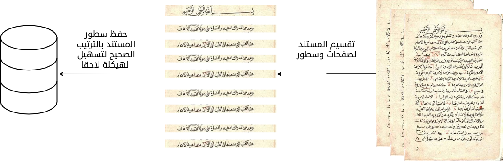
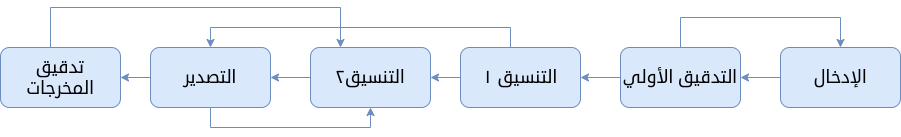

# مخطط لمشروع رقمنة الكتب عن طريق الجهد الموزع

#  الهدف
يهدف المشروع إلى إيجاد طريقة لرقمنة كتب التراث العربي عن طريق الجهد الموزع بين فئة كبيرة من الناس.

# مكونات النظام:

## وحدة تحليل المستند:
هذه الوحدة تستقبل مستند إما pdf أو مجموعة صور مرتبة ثم يقوم بتحليل كل صفحة على حدة ويستخرج كل سطر في صورة 
تحفظ كل صورة و تعطى معرف خاص بها يسهل إرجاعها إلى مكانها الصحيح في المستند
مخرجات هذه الوحدة ملف xml أو قاعدة بيانات يحوي على هيكلة الكتاب ومجلد فيه صور لكل أسطر الكتاب كل سطر  على حدة.

## وحدة توزيع الصور
تقوم هذه الوحدة باستخدام مخرجات وحدة تحليل المستند في صنع واجهة برمجية تستقبل طلب الصورة فتعيد صورة سطر ثم تستقبل مدخلات الطلب وتتأكد من صحته ثم تخزن القيمة النصية في مكانها الصحيح في المستند.

## وحدة بناء المستند:
عمل هذه الوحدة هو إعادة بناء المستند إلى صورته الأصلية لكن باستخدم النصوص المرقونة
مخرجات هذه الوحدة ملفات نصية أو html أو pdf أو كتاب اإلكتروني

## وحدة واجهة النظام للمستخدمين:
تعمل هذه الوحدة كواجهة استخدام للنظام حيث توفر:
- آلية تسجيل للأعضاء والمساهمين
- لوحة الإدارة: إدارة الأعضاء والمشاريع 
- مكان لإنشاء مشاريع كتب جديدة
- كل مشروع يوفر آلية رفع المستند غير المرقون ومتابعة مراحل تطوره إلى المرحلة النهائية
- صفحة المساهمة في الرقن وهي تتبع آلية الإدخال والتدقيق المذكورة لاحقا
- واجهة لعرض الاحصائيات من مثل الكلمات المرقونةوالأسطر وعدد المستخدمين الكلي و الفعلي و الكتب المنجزة

## آلية الادخال والتدقيق تمر بالمراحل التالية:
1. (إدخال أولي) جولة رقن النص من صورة السطر المجلوبة من وحدة توزيع الصور.
2. (التدقيق الأولي) جولة التدقيق ١ تدقيق للنص ومقارنته بالصورة بعناية. 
3. (التدقيق الثاني) جولة التدقيق اللغوي الأولى بعد أكتمل تدقيق نصوص السطور ، يلزم الآن فحصها عن كثب بحثًا عن الأخطاء الصغيرة التي ربما تكون قد فاتتها.
4.  (التنسيق ١) جولة التنسيق 1 لقد تم بالفعل تدقيق نصوص الصفحات ، ولكن يلزم الآن تنسيقها باستخدام ترميز html 
5. (التنسيق ٢) جولة التنسيق 2 يجب فحص نصوص الصفحات في هذه الجولة بعناية لإزالة أي أخطاء تنسيق متبقية.
6. (تصدير)  تحويل الكتب إلى نص إلكتروني نهائي. 
7. (قراءة الناتج ) قراءة سلسة قبل نشر نص إلكتروني نهائي يمكن تحميله اختياريًا للقراءة السلسة. 
8. (التحقق النهائي) التحقق قبل نشر الكتاب

الصورة التالية توضح سير هذه المراحل:

