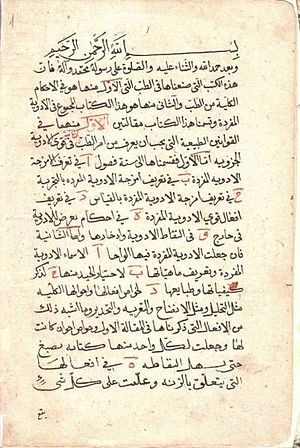
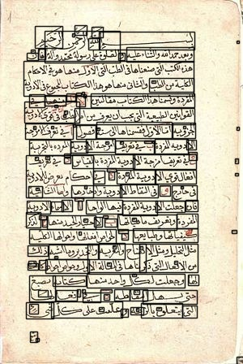

# وحدة التحليل
تقوم هذه الوحدة بقراءة الصورة والتعرف على مربعات النص بداخلها

## مثال
بالمثال يتضح المقال, البرنامج التالي يقوم بالتعرف على مربعات النص في الصورة.

`البرنامج ليس في افضل حالة`

```go
func main() {
	srcImage := gocv.IMRead("sample-img.jpg", gocv.IMReadFlag(1))

	// grayscale
	grayedImage := gocv.NewMat()
	gocv.CvtColor(srcImage, &grayedImage, gocv.ColorBGRToGray)

	// threshold
	thresholdImage := gocv.NewMat()
	gocv.Threshold(grayedImage, &thresholdImage, 150, 255, gocv.ThresholdBinaryInv)

	kernel := gocv.GetStructuringElement(gocv.MorphCross, image.Pt(3, 3))

	// dilate
	dilatedImage := gocv.NewMat()
	gocv.Dilate(thresholdImage, &dilatedImage, kernel)

	// get contours
	contours := gocv.FindContours(dilatedImage, gocv.RetrievalExternal, gocv.ContourApproximationMode(1))

	// for each contour found, draw a rectangle around it on original image
	for _, contour := range contours {

		// get rectangle bounding contour
		imageRect := gocv.BoundingRect(contour)

		// discard areas that are too large
		if imageRect.Max.Y > 300 && imageRect.Max.X > 300 {
			continue
		}

		// discard areas that are too small
		if imageRect.Max.Y < 40 || imageRect.Max.X < 40 {
			continue
		}

		// draw rectangle around contour on original image
		gocv.Rectangle(&srcImage, imageRect, color.RGBA{}, 1)

	}
	gocv.IMWrite("output.jpg", srcImage)
}
```
الصورة المدخلة:



الصورة المخرجة:


